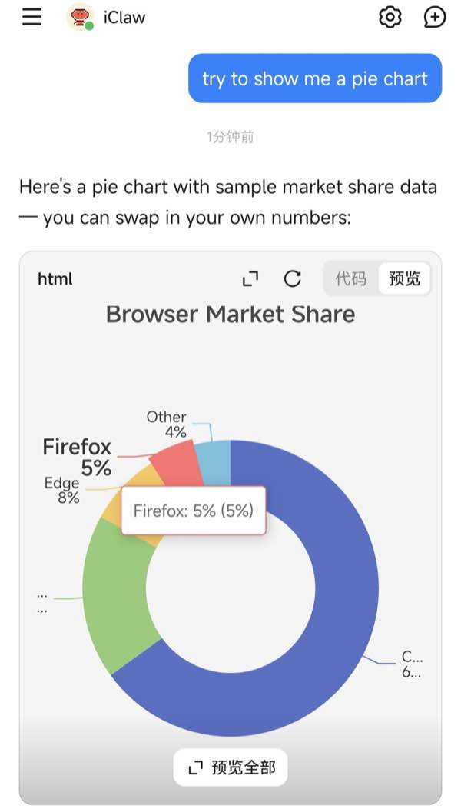
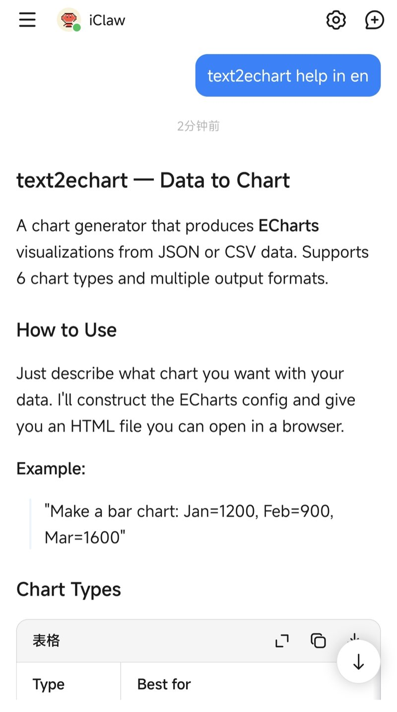
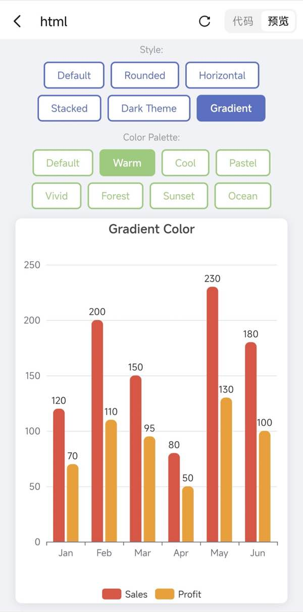
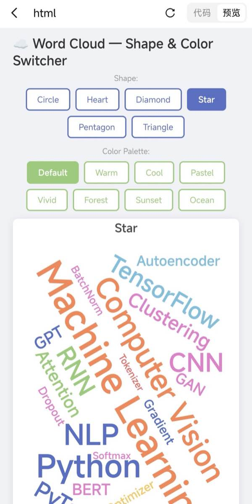

# text2echart — Data to ECharts Charts

Convert structured data (JSON / CSV) into beautiful ECharts SVG charts.
Zero npm dependencies. CLI + interactive Web App.

---

## Quick Start

```bash
# CSV to bar chart, open in browser
node cli.js sales.csv --open

# CSV to line chart with dark theme
node cli.js data.csv --type line --theme dark

# JSON to pie chart
node cli.js pie.json -o chart.html

# Pipe from stdin
cat data.csv | node cli.js - --embed
```

---

## CLI — `cli.js`

Zero npm dependencies — Node.js standard library only.

```bash
node cli.js <input> [options]
```

| Option | Description |
|--------|-------------|
| `-o, --out <file>` | Output file name (default: `chart-N.html`) |
| `--type <type>` | Chart type for CSV: `bar`, `line`, `pie`, `radar` (default: `bar`) |
| `--theme <name>` | Theme: `dark`, `infographic`, `macarons`, `roma`, `shine`, `vintage` |
| `--width <px>` | Chart width (default: 800) |
| `--height <px>` | Chart height (default: 500) |
| `--slide` | 960×540 PPT slide mode |
| `--svg` | SVG renderer |
| `--open` | Open in browser |
| `--embed` | Embed ECharts for offline use (~1MB) |
| `--help` | Show help |

**Input formats:**

CSV — auto-detected. First column = labels, remaining = values.
```csv
Month,Revenue,Cost
Jan,1200,800
Feb,1500,900
```

JSON — standard ECharts option or simplified `{type, data}`.
```json
{
  "series": [{"type": "bar", "data": [{"name": "A", "value": 30}]}],
  "title": {"text": "Sample"}
}
```

---

## Web App — `text2echarts.html`

Open `text2echarts.html` in any modern browser. All dependencies bundled — works offline.

**Features:** 6 chart templates (bar, line, pie, scatter, radar, wordcloud) • 6 themes • PNG/JPG/SVG export • Chinese/English toggle • drag-and-drop CSV/JSON input.

---

## Routing

The skill automatically routes requests to chart generation — HTML in chat by default, CLI for SVG/PNG export.

**Direct HTML generation in chat — pie chart example:**



**Inline skill documentation — help & discovery:**



---

## Project Structure

```
text2echart/
├── SKILL.md              # OpenClaw skill definition
├── cli.js                # CLI tool (zero deps)
├── prompt.md             # LLM prompt engineering guide
├── text2echarts.html     # Interactive web app
├── static/
│   ├── app.js            # Core logic (i18n, chart rendering, themes)
│   ├── styles.css        # Shared styles
│   ├── templates.js      # Chart templates (CN)
│   ├── templates-en.js   # Chart templates (EN)
│   └── lang/             # JSON language packs
├── lib/                  # Bundled ECharts libs
├── scripts/build.js      # Build script
├── test/                 # Test suite
├── references/           # ECharts option references (EN + 中文)
├── assets/               # Screenshots
└── docs/                 # Project docs
```

---

## Dependencies

- **CLI:** Node.js only. Standard library — no `npm install` required.
- **Runtime:** ECharts from CDN by default. Use `--embed` for offline (~1MB).
- **Web App:** All deps bundled in `lib/`. Works fully offline.

---

## Other Advanced Capabilities

### 1. Multi-Pattern Generation

The model can generate multiple chart configurations in a single response — combining different chart types, color palettes, shapes, and styles all at once.

**Bar Chart — independent style & palette switching in a single HTML:**



**Word Cloud — independent shape & palette switching in a single HTML:**



### 2. Full ECharts Series Support

This skill documents 6 chart types (bar, line, pie, scatter, radar, wordcloud), but the LLM can generate **any** ECharts series type. Modern LLMs handle them reliably:

**Additional Series Types:**
- **Candlestick** — financial OHLC (K-line) charts
- **Boxplot** — statistical distribution (quartiles, outliers)
- **Heatmap** — matrix-based and calendar heatmaps
- **Treemap** — hierarchical nested rectangles
- **Sunburst** — multi-level radial hierarchy
- **Sankey** — flow diagrams (energy, budget, traffic)
- **Funnel** — conversion funnel (marketing/sales)
- **Gauge** — dashboard speedometer gauges
- **Graph** — force-directed node-edge networks
- **Tree** — tree diagrams (LR, TB, radial)
- **PictorialBar** — bars with SVG symbols/icons
- **ThemeRiver** — streamgraph / ribbon time series
- **Lines** — flight/migration path lines (maps)
- **EffectScatter** — scatter with ripple animation
- **Map** — geo-map with region shading

**Additional Components:**
- **Parallel** — parallel coordinates (multi-dimensional data)
- **Custom** — fully custom renderers
- **dataZoom** — interactive scroll/zoom axis
- **visualMap** — continuous/piecewise color mapping
- **brush** — rectangular/polygon region selection
- **timeline** — animated time playback
- **dataset** — declarative data transform (filter, sort, aggregate)
- **markLine / markArea / markPoint** — annotation markers
- **aria** — accessibility labels
- **3D Charts** — echarts-gl: scatter3D, bar3D, surface, globe, lines3D
